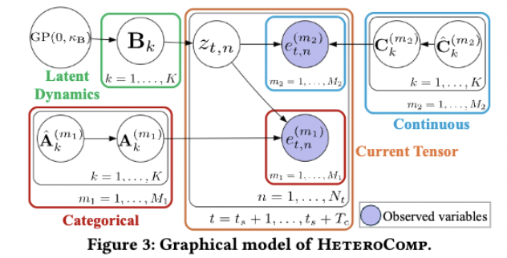
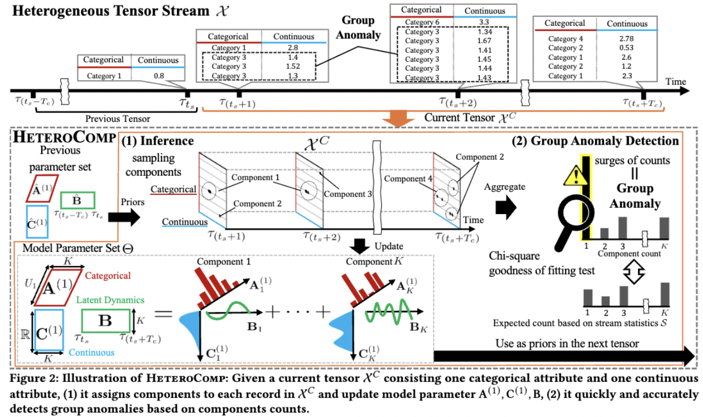

# HeteroComp: Multi-Aspect Mining and Anomaly Detection for Heterogeneous Tensor Streams

Official implementation of "Multi-Aspect Mining and Anomaly Detection for Heterogeneous Tensor Streams", Soshi Kakio, Yasuko Matsubara, Ren Fujiwara, and Yasushi Sakurai. at [the ACM Web Conference 2026 (WWW '26)](https://www2026.thewebconf.org/).

## Introduction
- We focus on event tensor streams consisting of timestamps and categorical attributes (e.g., IP address, port number) and continuous attributes (e.g., packet length, tcp duration), and refer such relationships as "heterogeneous tensor streams".
- We propose HeteroComp, a method for continuously summarizing heterogeneous tensor streams into "components" representing latent groups in each attribute and their temporal dynamics, and detecting group anomalies.
### Graphical Model
The graphical model of our model is following:

### Algorithm
The overview of our algorithm is following:



## Setup
- `Jaxopt` package contains a bug.
  - Please replace line 248 in `.venv/lib/python3.12/site-packages/jaxopt/_src/tree_util.py`
  ``` python
    if isinstance(
        # p, (bool, int, float, complex, onp.ndarray, jnp.ndarray) OLD
        p, (bool, int, float, complex, onp.ndarray, jax.Array) # NEW
    )
  ```


## Demo
```
    uv sync
    uv run main.py --config-name=edge model.name=heterocomp
    uv run plot_anomaly.py --config-name=edge
    uv run calc_anomalyscore.py --config-name=edge model.name=heterocomp
```
